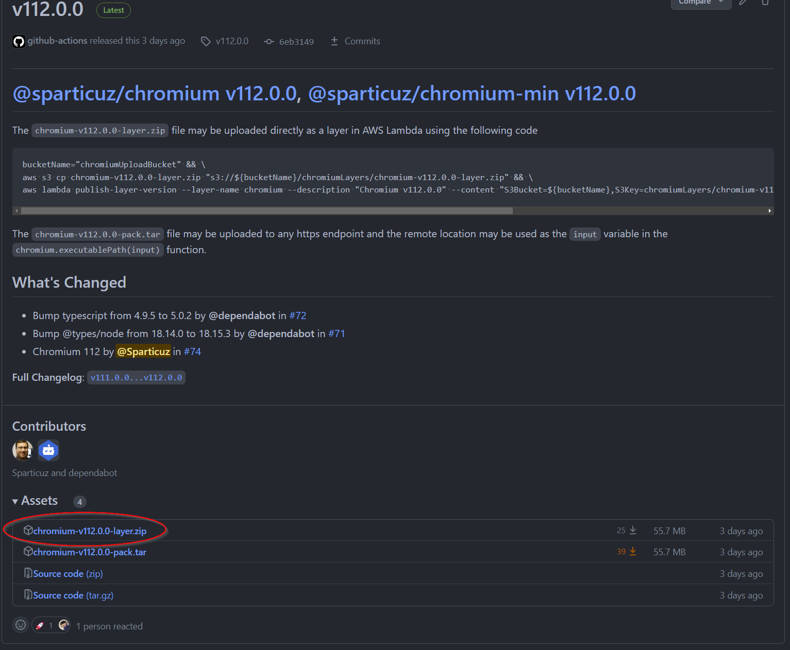
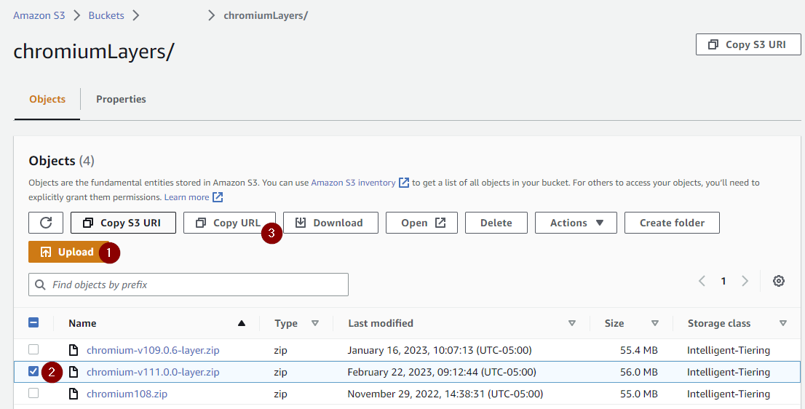
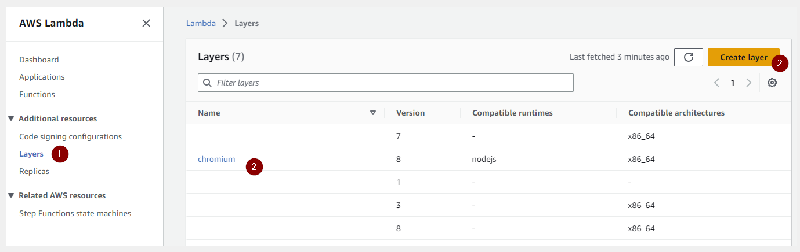
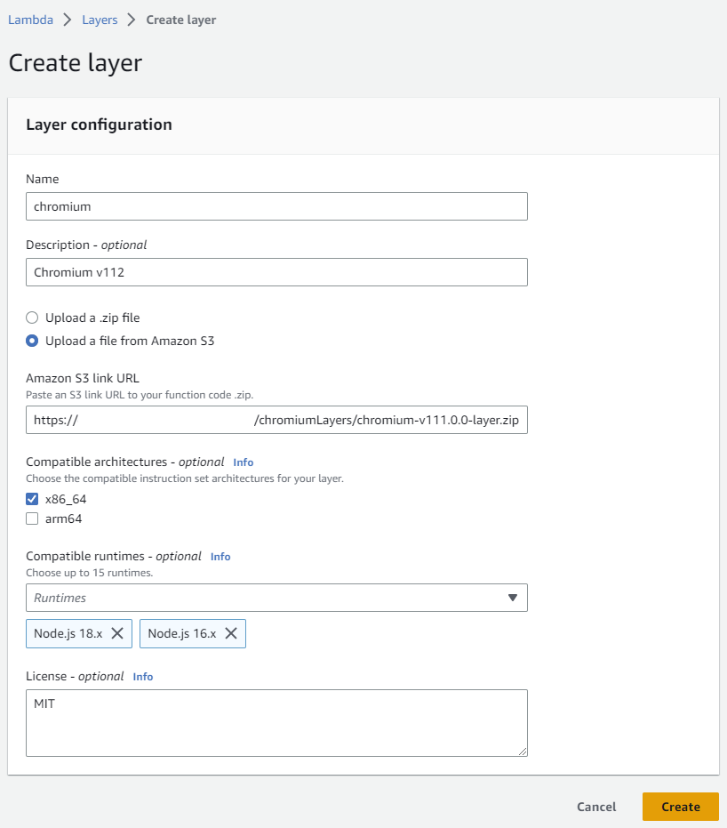

## Upload Lambda layer to AWS

1. Download the layer zip from Github Releases
   
2. Create a S3 bucket, or use a pre-existing bucket, upload the zip, and copy the URL
   
3. Create a new layer or use a pre-existing layer. (If using a pre-existing layer, Create a new verion)
   
4. Use the S3 file to load into to AWS Lambda Layers
   
5. Add the layer to your serverless function

```yaml
service: sls-with-preexisting-layer

provider:
  name: aws
  runtime: nodejs18.x
  stage: dev
  region: us-east-1
  timeout: 300

functions:
  chromium-test:
    handler: index.handler
    layers:
      - arn:aws:lambda:us-east-1:************:layer:chromium:*
```

# BONUS

These steps can easily be automated using the following code:

```shell
$ chromiumVersion="112.0.0"
$ bucketName="chromiumUploadBucket"
$ wget "https://github.com/Sparticuz/chromium/releases/download/v${chromiumVersion}/chromium-v${chromiumVersion}-layer.zip"
$ aws s3 cp "chromium-v${chromiumVersion}-layer.zip" "s3://${bucketName}/chromiumLayers/chromium-v${chromiumVersion}-layer.zip"
$ aws lambda publish-layer-version --layer-name chromium --description "Chromium v${chromiumVersion}" --content "S3Bucket=${bucketName},S3Key=chromiumLayers/chromium-v${chromiumVersion}-layer.zip" --compatible-runtimes nodejs --compatible-architectures x86_64
```
